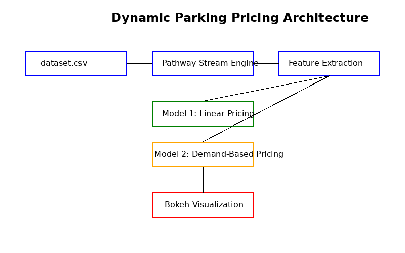

# 🚗 Dynamic Pricing for Urban Parking

Capstone project for Summer Analytics 2025 by Consulting & Analytics Club, IIT Guwahati.

## 📌 Overview

Urban parking is often underutilized or overcrowded due to static pricing. In this project, we built a real-time dynamic pricing engine for 14 parking lots using historical and live data, built entirely from scratch using Python, Pandas, Numpy, and Pathway.

## 💻 Tech Stack

- Python
- Pandas
- Numpy
- Pathway (Real-time streaming)
- Bokeh (Visualization)
- Google Colab / Kaggle
- GitHub

## 🧠 Architecture Diagram

## 🔍 Workflow

1. ✅ Load dataset and clean
2. ✅ Use Pathway to stream the data in real time
3. ✅ Extract relevant features (occupancy, queue length, traffic, etc.)
4. ✅ Apply pricing logic using:
   - Model 1: Linear pricing based on occupancy
   - Model 2: Advanced demand-based pricing
5. ✅ Visualize pricing trends using Bokeh

## 📁 Folder Structure
dynamic-parking-pricing/
├── cleaned_dataset.csv
├── pricing_model.ipynb
├── README.md
├── diagram.png
└── report.pdf

Created by Yatharth Bhatt
Email: yatharthbhattofficial@gmail.com
